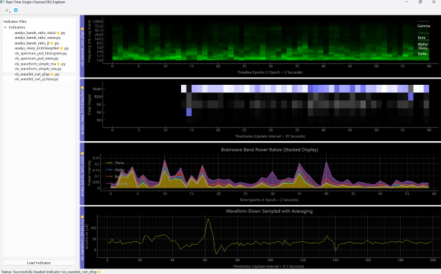
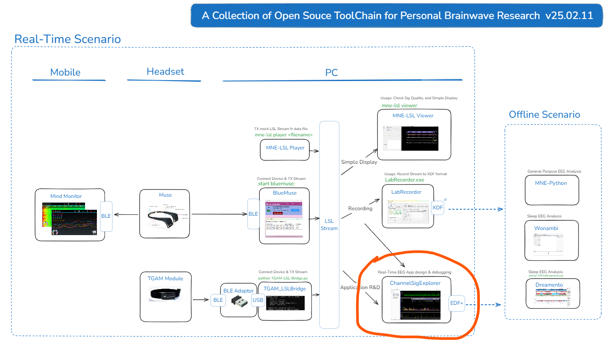

## How does it look like?

-------------------
## User scenarios for this software could be：
* **Real-time** data analysis/visualization tool for BioSignal channel. In another word, **real-time** visualization tool for [MNE-LSL](https://mne.tools/mne-lsl/stable/index.html) Stream's single channel
* Gallary framework for BioSig indicators
* Connectivity examples for EEG headbands
* EEG headband quality evaluation tool
* An End-to-End example for BioSig/EEG applications

And it was originally composed to fit the place below:

---------------
## How to Run
#### 1. Hardware requirement
  * this software is tested based on PC with metrics: 2.60Ghz CPU + 8G Memory + Win11 (no graphic card)
  * if with less hardware resource, e.g.2.0Ghz CPU + 4G Memory + Any OS, it should also be alright to run indicators in tutorial. But if you write own advanced indicators, or connect to new device, then it may change hardware requirements.

#### 2.Setup Environment
    conda create -n py12_env python=3.12
    conda activate py12_env
    conda install --file requirements.txt

#### 3.Execute below commands in two different anaconda prompts
    mne-lsl player "../tools-LSLstream_providers/sample_data_SC4001E0-PSG.edf"
    python main_window.py
   
----------------

More details could be found in [introduction](introduction) folder.

----------------
Moreover, currently this is my hobby project to explore brainwave in order to improve personal practice in meditation. If you have found any interesting way to use this software, posting it by opening "issues" here would be very helpful to others! Cheers!
